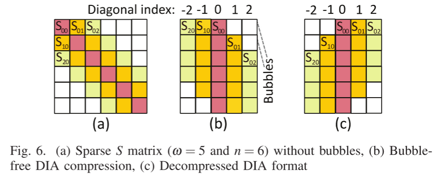
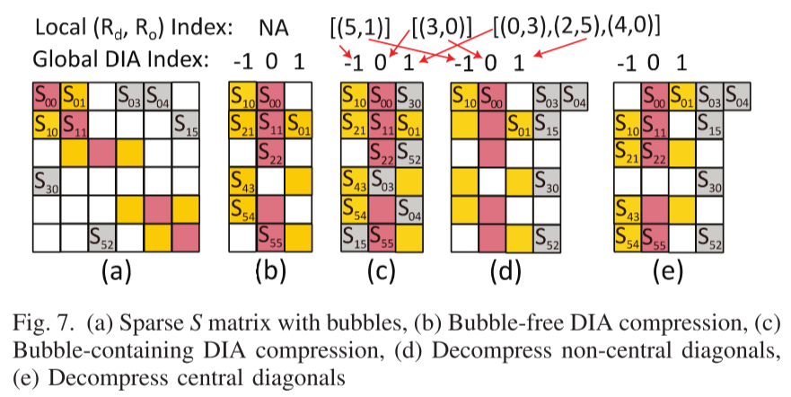
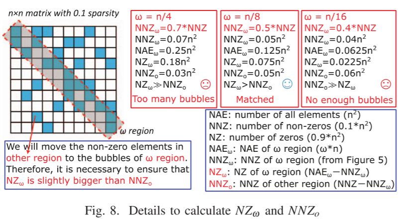
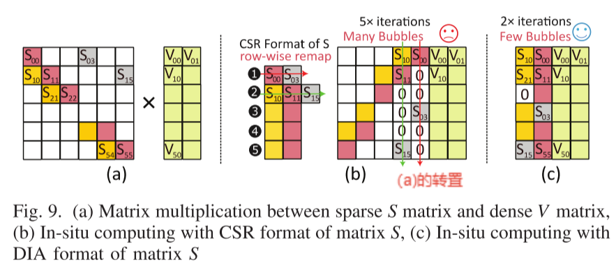
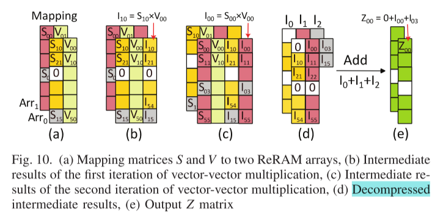
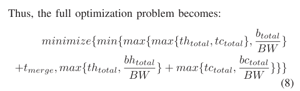
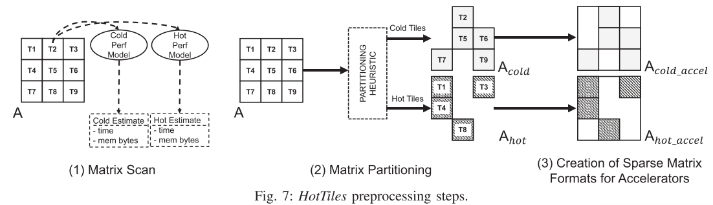
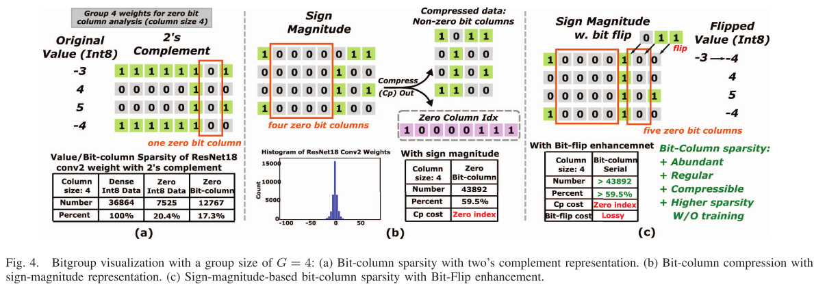
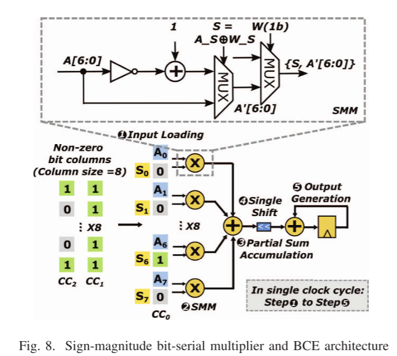

### ASADI: Accelerating Sparse Attention using Diagonal-based In-situ Computing

**会议/作者：**

> 2024 HPCA
>
> Huize Li, Zhaoying Li, Zhenyu Bai, and Tulika Mitra
>
> National University of Singapore

**研究层次：**

> 对角矩阵的压缩格式，用ReRAM搭建Transformer架构

**概述**：

本文找到了一个稀疏矩阵的新应用场景：稀疏注意力机制下的对角矩阵。文章工作主要有两点：

1. ==软件==：建立新的对角线编码格式与数据流，并介绍了这种新编码格式在SPMM和SDDMM上的数据流。对于bubble-containing的矩阵(不严格对角)(fig.7)：选择适当的$w$,  保证元素**列号不变**，填入最近的对角线。

   

计算数据流：A矩阵的列与B矩阵的行对齐相乘，decompress后累加。

2. ==硬件==：一种面向transformer模型的存内计算ReRAM的结构。稀疏+存算怎么去结合，再仔细看一下硬件ReRAM

fig10的(d)是个问题，在硬件上如何解压缩、累加，文中并没有提到（避重就轻）。存算上的稀疏也卡到了部分和累加这一步。

### HotTiles: Accelerating SpMM with Heterogeneous Accelerator Architectures
**会议/作者：**

> 2024HPCA
>
> Gerasimos Gerogiannis†‡, Sriram Aananthakrishnan†, Josep Torrellas‡, and Ibrahim Hur†
>
> 英特尔、伊利诺伊大学厄巴纳-香槟分校

**研究层次：**

> 建模、异构、调度

**概述：**

本文提出了`矩阵内异构`(Intra-Matrix Heterogeneity)：稀疏矩阵中的非零值分布是不均匀的，非零值来自密集区域和稀疏区域，而不是均匀分布在整个矩阵中。但目前的加速器对矩阵的所有区域都采用相同的PE，导致加速效果不佳。

利用矩阵内异构的特点，把一个稀疏矩阵分成多个tiles,较稠密的tile被称为`hot tile`，用计算密集的计算单元(`Hot Worker`)处理，稀疏的`tile`用访存友好(`memory-bound`)的计算单元(`Cold Worker`)处理。

本文工作重点在对矩阵不同区域进行分类(hot or cold)，提出了评估`cold tile`和`hot tile`的模型框架：估计访问主存的总bytes；估计每一个tile的计算时间(Execution Time，实际上算的是FLOPs)。并用启发式算法搜解：

**启示：**

* 专门的计算给专门的部件处理，定制化、专业化是加速的重要方法(但背后的开销不小)。同时，我也看到很多文章为了加速、优化无所不用其极(例如，SIGMA为了避免所有的无效计算，设计了一个非常复杂的网络。也可以说SIGMA就是为双边极度稀疏做的优化，面对稠密矩阵乘，这个可配置的网络会变得非常大、深。)但学术就是这样，它提供给了你一个自由想象、天马行空的舞台，学者也不要被工业实际过于束缚手脚。牢记、牢记。
* 我们真的有必要如此鄙视缝合怪吗？

### BitWave: Exploiting Column-Based Bit-Level Sparsity for Deep Learning Acceleration
**会议/作者：**

> Man Shi∗, Vikram Jain∗, Antony Joseph‡, Maurice Meijer‡, Marian Verhelst
>
> 鲁汶大学，NXP(恩智浦半导体)

**研究层次：**

> 比特级稀疏(bit-level sparsity)

**背景：**

现有问题：现有的位串行加速器利用位级稀疏性通过跳过零位来减少计算量，但由于非零位的不规则索引导致了低效的内存访问。文章总结性地提出了**内存访问通常是DNN加速器性能的主要影响因素**。本文提出了一种`bit-column-serial`的计算方式，并给出了`Bitwave`的硬件结构，在我目前看过的文章中，`Bitwave`第一次将稀疏引到了`bit`级(以前都只是关注元素的稀疏，一个数为零或非零).(==这篇文章是`bit`级稀疏首创吗？==)

**概述：**

* 这篇文章的核心idea用fig4就可以概括。
* 先将矩阵中多个数进行打包，找到公共的零列，就能将公共的零列去掉。用补码(fig4.a)表示数字与用原码表示数字(fig4.b)相比，原码表示形式能够凑成更多的零列(因为DNN中很多数都分布在0的附近，因此`int8`的3~7位大多是0)。去掉的零列用`idx`标记出来。
* 为了凑更多的零列，本文提出了`bit flip`的方法(fig4.c)，我将一些数的某些位进行翻转,能够凑出更多的零。那后期怎么补偿这一修正呢？不补偿！文章说：

> Our findings illustrated in Figure 6(a), with ResNet18,reveal that most layers exhibit negligible accuracy degradation when the entire layer is forced to have less than
> four zero columns.We also observe that early layers (weight-light layers) in ResNet18 tend to be more sensitive than later layers (weight-heavy layers).
>
> ......we selectively flip the weight-flip- non-sensitive layers to more zero columns (4-7), while for weight-flip-sensitive layers to less zero columns (1-4) or leave untouched, ensuring maximization of the compression ratio and minimization of accuracy degradation.

一句话总结就是：少量的`bit flip`对准确性影响不大；对`bit-flip`敏感的层，少一些`bit-flip`.  一开始我觉得不可思议，还能这么玩？后面想想，AI、DNN本来就是模糊计算，玩点`trade-off`无伤大雅。而且`bit-flip`这一个点又做了大量的实验来佐证，充实了文章内容。

* 计算模块如fig8所示，无需多言。注意：这是一个位串行的计算单元。一个单元完成了向量$[S_7:S_0]$与$[A_7:A_0]^T$的乘法。相当于`Tensor Core`中的一个`DPFE`

**启示：**

* 文章写作上讲出方案的渐进性是否有必要：本文先讲了用补码来表示`int8`的数，从而凑出零列。接着讲“我们实验表明矩阵中大部分元素都分布在0附近”，所以用原码这种表示格式能够凑出更多的零列。在这之后又提出了`bit flip`的方法，进一步凑出更多的零列。这几步都是渐进式的工作，在文章中写出，让人感觉无懈可击。
* 如何把工作做深：记得以前在知乎上看到赵夏表达了类似这样的观点：**去把工作做深`比`想出一个idea更难**。如果这个点让我来做，我会做成什么样？也许我会止步于找出零列，然后压缩、存索引吧，这样的工作很naive。我应该不会想到`bit flip`这么"冒进"的做法.怎么把工作做深？可以大胆假设、别出心裁(像bit-flip)；可以推广到一类问题，分析问题产生的本质与原因……
* 这篇文章最让我眼前一亮的就是`bit flip`。记得以前中第说，“公式要推，都能推出来，只要加假设就行了。”对AI这种模糊计算，确实可以加一些假设、修正让问题更好做。