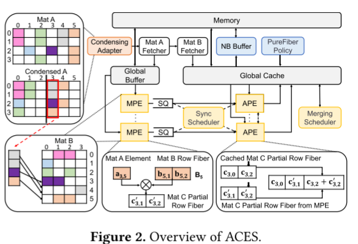
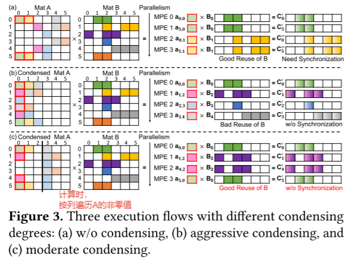
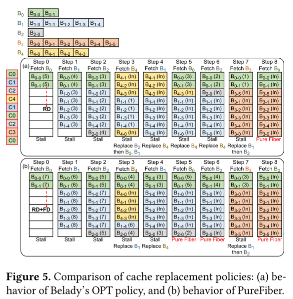
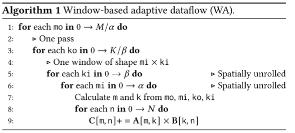
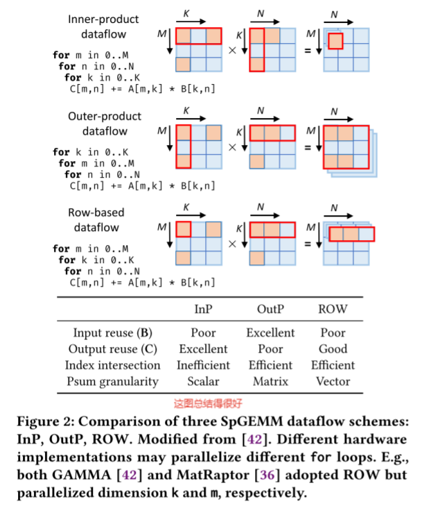

### ACES: Accelerating Sparse Matrix Multiplication with Adaptive Execution Flow and Concurrency-Aware Cache Optimizations

**会议/作者信息：**

> 2024 Asplos
>
> [Xiaoyang Lu](https://xiaoyang-lu.github.io/) , Boyu Long ,  **Xiaoming Chen** ,  Yinhe Han  ,  Xian-He Sun
>
> 伊利诺伊理工学院， 中科院计算所

**研究层次：**

> Adaptive Execution Flow(自适应数据/执行流), Cache Concurrency(cache并发)，no-block buffer

**研究背景：**

* 当前的稀疏加速器在适应不同的稀疏模式、优化cache性能方面仍然面临挑战.
* 当前的加速器都是使用固定的数据流(内积、外积、row-wise)：内积能充分复用C矩阵，但索引交集效率低；外积对于输入矩阵复用性好(A、B矩阵每一列、每一行都只要访问一次)，但瓶颈在中间矩阵的累加；`row-wise`是内外积的折中，但A矩阵不规则的非零值分布使得B的复用面临挑战，而且，PE并发工作时，若不同的PE**生成同一行的输出结果**时，二者之间的**cache并发**问题面临挑战。
* 之前的加速器工作都着重关注减少`cache-miss`  (`Spada`  `Gamma`  `Sparch`) , 但忽略了`cache 并发`，没有解决`cache`并发问题，容易造成停顿，这时就需要同步(或调度)cache的读写，以避免停顿或数据误写。同时，当前加速器中的`cache`设计并未包含非阻塞功能,因此单个`cache-miss`会导致后续访问延迟，从而加剧性能瓶颈。

**概述：**

* 总体架构

`ACES`采用的是`ROW`的数据流，每一个MPE中计算一次**标量-向量乘**，得到矩阵的一行。APE内完成一行向量的累加，MPE计算结果存在SQ中，`Sync Scheduler`将SQ中数据有效调度给APE进行`row-merge`，避免APE的停顿，同时通过`Sync Scheduler`的调度可以解决APE之间的同步问题：当多个APE同时读写cache中C矩阵的同一行时，可能出现数据误写等问题。

* **Adaptive Execution Flow**

本文提出了三种执行流：(a)是不对A矩阵进行压缩，按列遍历A的NZ，将每一个NZ送入MPE中进行一次标量-向量乘。这种执行流对B矩阵有很好的复用性，但产生的行需要进行累加，这时同步问题就凸显了。(b)对A矩阵进行激进的压缩，B矩阵复用性不好，但产生的行之间不需要累加，APE之间不存在同步问题；(c)就是前面两种方案的折中。

之后就是将A矩阵进行划分，不同的块用不同的格式去做。(如何区分？采样)

* **Global Cache and PureFiber Policy**

两个参数：`RD`(next Request Distance) and `FD`(Fiber Density):

`RD`指cache中一个数据下一次被访问的期望时间差(expected time until the fiber is next requested.)这个数据通常时根据之前的访问模式进行预测的。

`FD`指B矩阵一个`fiber`中数的多少(the number ofcache lines in the corresponding fiber)。

①RD越大，表示当前数据在此刻被访问的概率越小，当新数据写入cache时，优先覆盖RD大的数据。②FD越大，表示B的这一行的NZ越大，占据越大的cache容量，将会带来更大的cache-miss，因此当新数据写入cache时，优先覆盖FD大的数据。

fig5是本文的cache策略与`Belady's OPT policy`(**1966**)的对比。(a)只用RD作为cache数据覆盖的依据，而(b)用RD+FD作为数据覆盖的依据，结果是在该实例中，(a)只有一次`pure fiber`，即只有一次cache全命中，而(b)有三次全命中。

* **Non-Blocking Buffer**

不是本文创新点，"ACES **integrates** an NB buffer with the global cache"。Non-Blocking Buffer在1998年就已提出：

> David Kroft. Lockup-free instruction fetch/prefetch cache organization. In 25 years of the international symposia on Computer architecture (selected papers), pages 195–201, 1998.

### Spada: Accelerating Sparse Matrix Multiplication with Adaptive

**会议/作者：**

> Zhiyao Li , Jiaxiang Li , Taijie Chen , Dimin Niu , Hongzhong Zheng , **Yuan Xie , Mingyu Gao**

**研究层次：**

> Adaptive Dataflow

**研究背景：**

> 现有的 SpGEMM 加速器仅支持特定类型的数据流，例如内/外积或ROW-wise的方案。 每个数据流仅针对某些稀疏模式进行优化，无法以稳健的性能泛化到跨不同领域的广泛多样化的 SpGEMM 工作负载。本文设计了一种window-base的可适应数据流。

**概述：**

本文提出了一种自适应数据流(并非内外积、Row-wise三种数据流的缝合)，而是用一种窗口的方式做到数据流的自适应：

> This means that a naive design that tries to **directly combine** InP, OutP, and ROW is unlikely to work well, as they have drastically different execution behaviors.
>
> Instead of precisely resembling the exact execution behaviors of all dataflow schemes, we only aim to **capture their key benefit**s of data reuse on different sparse patterns.

一张总结得不错的图：

